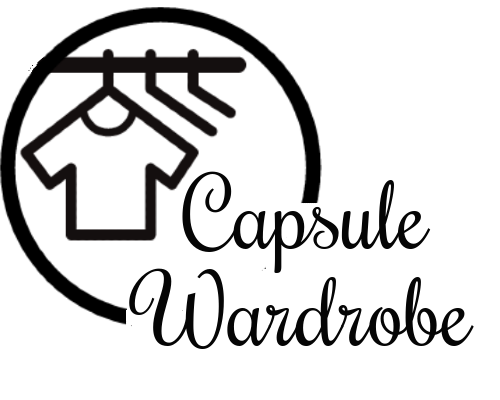
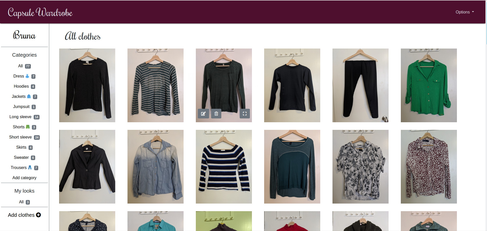
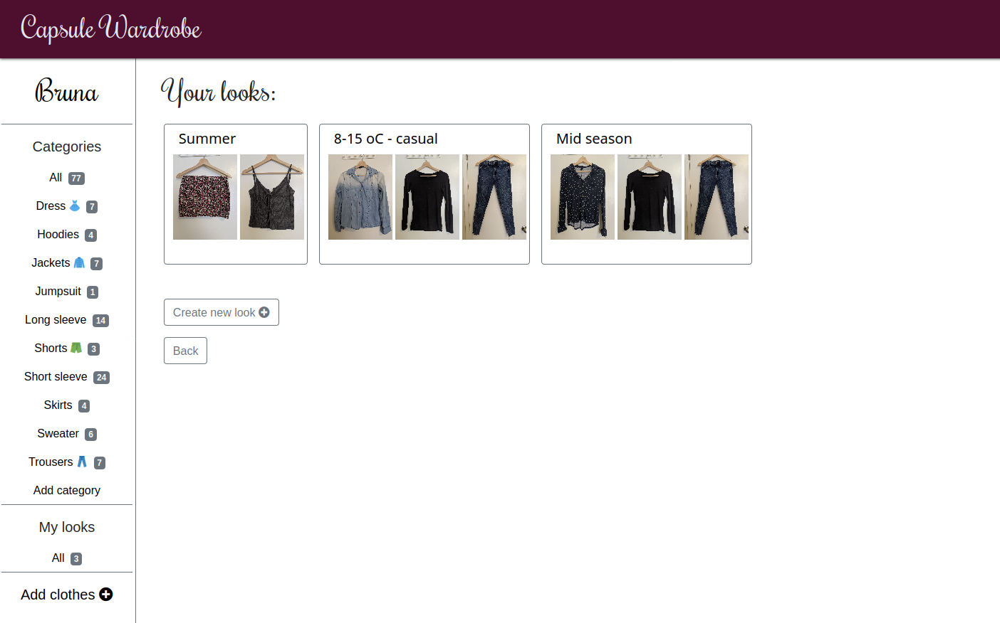
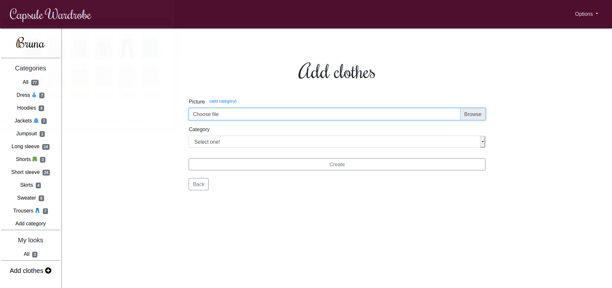

<h1 align="center">
  <br>
  <a href="logo"></a>
</h1>

<p align="center">Practicality and sustainability without losing style.</p>
<h4 align="center"><a href="https://agile-sea-56583.herokuapp.com/">Start now >></a></h4>

## Table of Contents

- [About the app](https://github.com/bruna-genz/Capsule_Wardrobe#about-the-app)
- [About Capsule Wardrobe](https://github.com/bruna-genz/Capsule_Wardrobe#about-capsule-wardrobe)
  - [What is capsule wardrobe?](https://github.com/bruna-genz/Capsule_Wardrobe#what-is-capsule-wardrobe)
  - [Why does it matter?](https://github.com/bruna-genz/Capsule_Wardrobe#why-does-it-matter)
- [Preview](https://github.com/bruna-genz/Capsule_Wardrobe#preview)
- [Built with](https://github.com/bruna-genz/Capsule_Wardrobe#built-with)
- [Getting started](https://github.com/bruna-genz/Capsule_Wardrobe#getting-started)
- [Installation](https://github.com/bruna-genz/Capsule_Wardrobe#installation)
  - [Prerequisites](https://github.com/bruna-genz/Capsule_Wardrobe#prerequisites)
  - [Downloading and installing steps](https://github.com/bruna-genz/Capsule_Wardrobe#downloading-and-installing-steps)
- [Author](https://github.com/bruna-genz/Capsule_Wardrobe#author)
- [Future features](https://github.com/bruna-genz/Capsule_Wardrobe#future-features)
- [Show your support](https://github.com/bruna-genz/Capsule_Wardrobe#show-your-support)

## About the app
Capsule Wardrobe is a virtual catalog where users can upload clothes pictures, classify them in lists, and create personalized looks.

I created this project to join two of my interests: improving my Rails skills and having a more sustainable wardrobe. With the concept of Capsule Wardrobe in mind, I planned and designed an application that would help me in the process of building my own capsule wardrobe, taking into consideration my needs to create the app's features, such as adding personalized categories and the ability to create looks for future reference. During the creation of the app, I had to find solutions for some problems, such as finding an affordable way to store the images permanently.

## About Capsule Wardrobe
### What is capsule wardrobe?
Capsule wardrobe it's a collection of a few essential and versatile clothes that don't go out of fashion. They can be mixed and matched to create a wide variety of outfits for everyday use. They can be mixed and matched to create a wide outfits variety for everyday use.

### Why does it matter?
- Because it helps us protect the environment. The fashion industry is the second-largest polluter in the world, just after the oil industry.
- Because it saves money. Buying fewer clothes means you will have more money for things that matters more for you. 
- Because it saves time. A capsule wardrobe is practical and functional, reflecting your lifestyles and taste, so you won't stay anymore in front of the closet thinking on what to wear.

## Preview

#### Home page


#### Looks


#### New clothes form


## Built With

- HTML5;
- ERB;
- CSS3;
- Bootstrap;
- Ruby on Rails;

## Getting Started
Open [this link](https://agile-sea-56583.herokuapp.com/) and create an account. Next, upload images of the items you selected to compose your capsule wardrobe and categorize them. From there, you will be able to create looks and classify them in a way that works better for you.

## Installation 

#### Prerequisites

- Ruby
- Rails

#### Downloading and installing steps: 

To install a local version of this project, follow these steps:

- Clone the repository running the following command: 

```
git clone git@github.com:bruna-genz/facebook_clone.git
```

- Open the project's folder on your text editor and install the required gems by running:

```
bundle install
```
- Migrate the database to your machine:

```
rails db:migrate
```

- Start the server:

```
rails server
```

- With the server running, go to ```http://localhost:3000``` and the app should be working.

## Author

:woman: **Bruna Genz**

- Github: [@bruna-genz](https://github.com/bruna-genz)
- Twitter: [@Bruna_GK](https://twitter.com/Bruna_GK)
- Linkedin: [Bruna Genz](https://www.linkedin.com/in/brunagenz/)
- Email: brunagenz92@gmail.com

## Future features

- Create temperature categories on the created looks and integrate the app with a weather API, so it can suggest looks based on the current temperature.
- Create a virtual shop, where users can sell their clothes to other users.


## Show your support

Give a ⭐️ if you like this project!
